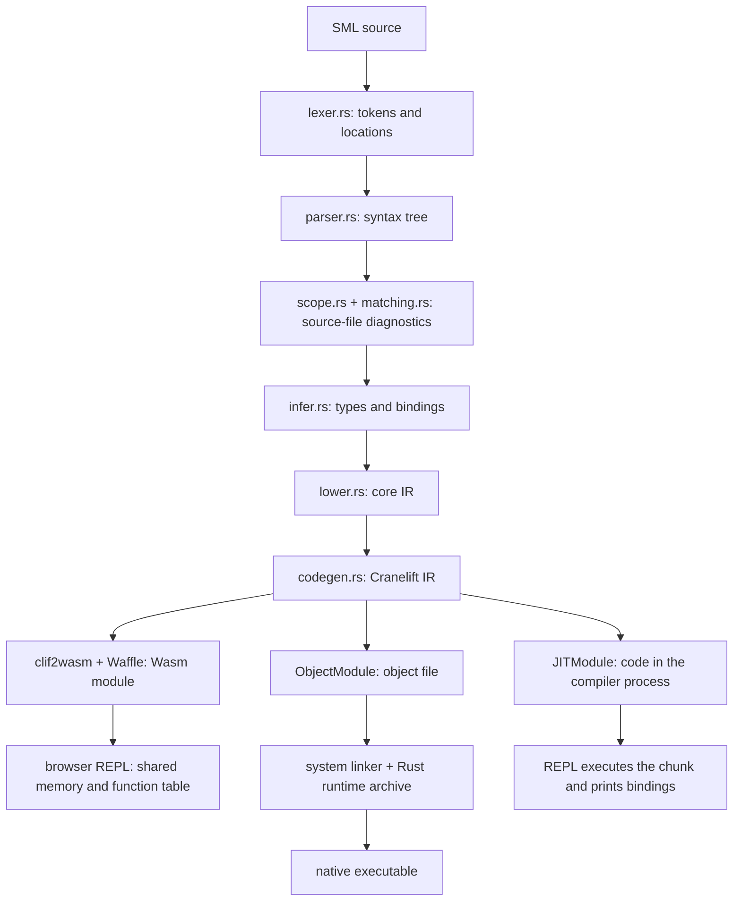

# Architecture

Nassau is a Standard ML compiler written in Rust. Cranelift emits native
machine code for file compilation and the native REPL. The browser REPL uses
the same CLIF emitter, then clif2wasm and Waffle translate its output to Wasm.
All paths share the type checker and lowering pass; both REPLs share the
session and value printer.

A useful way to read the project is to follow one binding from source to its
compiled value. [grammar.md](grammar.md) describes which language forms can
make that journey today.

## From source to machine code

The diagram shows the source-file checks in the file compilation path. The
REPL goes from parsing to its persistent inference session; it does not run
those separate scope and match diagnostic passes today.

[main.rs](../src/main.rs) connects the stages and implements the command-line
options. Passing a file produces an executable beside it. Running without a
file starts the REPL. The compiler targets the host machine through
Cranelift's native ISA builder; there is no cross-compilation CLI yet.

### Reading and checking source

[lexer.rs](../src/lexer.rs) produces tokens carrying their original locations.
[parser.rs](../src/parser.rs) builds the syntax tree and applies the fixities
in scope. The syntax types live in that file as well. A node is wrapped in
`Span<T>` from [span.rs](../src/span.rs), so later stages can report an error at
the expression or declaration that caused it.

Before type inference, source-file compilation checks duplicate bindings and
match rules. [scope.rs](../src/scope.rs) handles binding checks, while
[matching.rs](../src/matching.rs) checks redundancy and exhaustiveness using
pattern matrices. [constructors.rs](../src/constructors.rs) tracks constructor
families, and [walk.rs](../src/walk.rs) walks the tree with the right declaration
environment. These checks distinguish constructors from variables by scope,
rather than by the spelling of a name.

[infer.rs](../src/infer.rs) supplies Hindley–Milner inference, unification,
generalization, the value restriction, equality constraints, overloaded
operators, and flexible record resolution. Its result contains top-level
bindings and a `TypeTable` for the expressions and patterns. Lowering uses
that table to choose operations and layouts. The table keys nodes by their
addresses, so the parsed tree stays in place between checking and lowering.

[infer/modules.rs](../src/infer/modules.rs) handles structures, signature
matching, ascription, sharing, and functor elaboration. The type table records
each structure's exports and retains a separate syntax tree for every
functor application. Each tree has its own expression and pattern types, so
applications with different argument types get the correct operations and
value layouts.

### Making execution explicit

[lower.rs](../src/lower.rs) turns the typed syntax into the small intermediate
language defined in [core.rs](../src/core.rs). Expressions are broken into
named operations. Branches become blocks with parameters, and each block ends
in a return, jump, conditional branch, call, or exception operation.

For example, `fun add x y = x + y` becomes a worker that takes its environment
and both arguments. The partial-application entry points build closures with
the arguments supplied so far. A known call such as `add 2 3` can go directly
to the worker; a call through an unknown function value loads the code address
from its closure.

Lowering also captures free variables, allocates mutually recursive closures,
chooses record field positions, and records which handler covers a call.
[lower/decision.rs](../src/lower/decision.rs) compiles patterns into decision
trees with SML's first-match behavior. The resulting core IR already says
which values to construct, fields to read, tests to perform, and exceptions to
raise. Structures keep exported value bindings and substructures in the
lowering environment, with no runtime module object. Functors capture their
declaration environment and lower the typed body of each application with
the argument's restricted exports. Code generation does not need to
rediscover those language decisions.

### Giving Cranelift the program

[codegen.rs](../src/codegen.rs) translates core operations and blocks into
Cranelift IR. Compiled SML functions use Cranelift's tail calling convention,
with the closure environment followed by their arguments. Values crossing
function boundaries are machine words. Program and REPL entry functions, and
calls into the support library, use the platform calling convention.

Tail-position calls use `return_call` or its indirect counterpart. A call under
an exception handler must return to that handler, so it is emitted as an
ordinary call. Cranelift then optimizes the IR, allocates registers, and emits
machine code.

Three module implementations handle the output. `ObjectModule` emits
an object file for file compilation. `JITModule` keeps code and global cells
inside the compiler process for the REPL. The translator is generic over the
module interface. `clif2wasm::WasmModule` translates the same CLIF through
Waffle into Wasm for the browser REPL.

### Executing in the browser

The `web` feature exports a `wasm-bindgen` `BrowserRepl` wrapping the shared
session with a Cranelift/Wasm backend. [www](../www/README.md) packages the
compiler for `wasm32-unknown-unknown` with local editor assets and a worker
that owns the session. No native REPL process is required.

Each submission translates CLIF through clif2wasm and Waffle, then instantiates
a Wasm module importing the session's memory, function table and stack pointer.
Earlier function exports and stable global addresses preserve saved closures
when bindings are shadowed. Tagged values remain 64-bit words; memory addresses
and function-table indices use Wasm's 32-bit representation.

The JavaScript runtime supplies allocation, mark-and-sweep collection, output
and exception state. Roots include active generated frames, visible globals,
host printing and historical globals reached through live closures. Stop and
reset replace the worker, releasing its code and heap.

The `codegen` feature enables the common CLIF emitter; `native` adds Cranelift's
JIT and object backends, CLI dependencies and the native runtime. A frontend-only
library builds with `--no-default-features`. There is no separate core-IR
interpreter or native `--interpret` mode.

## Values, memory, and the runtime

Every SML value crossing a function boundary occupies one 64-bit word. Its low
bit distinguishes an immediate from a heap pointer. Integers, characters,
booleans, unit, and nullary constructors are immediate; strings, records,
closures, references, and boxed reals use heap blocks. Polymorphic code can
therefore pass a value without knowing its concrete type.

[value.rs](../src/value.rs) defines the shared tags, block kinds, integer
limits, and built-in exception ordering. Both the compiler and support runtime
use it. [value-representation.md](value-representation.md) gives the exact
layout, including which fields a future garbage collector would trace.

Language operations with no special host requirement are generated by the
compiler. [codegen/helpers.rs](../src/codegen/helpers.rs) builds functions for
string concatenation, integer formatting, and structural equality. A helper is
emitted only when the program or REPL chunk uses it; later chunks reuse its
function ID. Generic byte copies and comparisons use Cranelift's libc calls.
Raising and catching exceptions are emitted at their use sites.

[runtime/nassau_runtime.rs](../runtime/nassau_runtime.rs) is the remaining
support library. It owns the bump allocator, host printing and process exit,
built-in exception identities, and the shared exception state. It is a
`no_std` Rust module and calls libc for allocation and I/O. The allocator
obtains memory in chunks and never frees them; there is no collector yet.

[build.rs](../build.rs) compiles that module with `rustc` to a native object and
packs it into `libnassau_runtime.a` with `ar`. [src/runtime.rs](../src/runtime.rs)
provides the compiler-side declarations, REPL wrappers, JIT symbol addresses,
and an embedded copy of the archive. For a compiled program, code generation
writes the archive to a temporary file and invokes `cc`, or `NASSAU_CC`, to
link it with the program's object. The JIT calls the runtime already linked
into the compiler, without linking a new executable for each input.

## Exceptions without stack unwinding

An exception value holds a constructor identity, an optional argument, and the
location of its first raise. Each evaluation of a fresh exception declaration
creates a new identity; replication shares the existing one.

A function that raises stores the exception in the runtime's shared cell and
returns the word `0`. That word cannot be a valid SML value. Its caller checks
the result and either enters the enclosing handler or returns `0` itself. A
handler takes the exception from the cell and runs its pattern decision tree.
Re-raising preserves the original location.

If an exception escapes a compiled program, the runtime reports it and returns
an unsuccessful exit status. In REPL mode, it leaves the value for the REPL to
report and keeps the session alive. This design needs no host-language panic
or native stack unwinding machinery.

## The basis library

Basis modules are written in SML under `basis/` and embedded into the compiler
by [prelude.rs](../src/prelude.rs), which checks them before the user's
program in the same `infer::Session`. Each program keeps its own type table, so
`--dump-expr-types` lists only the user's nodes. `lower::Session::lower_parts`
lowers the basis and the program into one module, each part read against its
own `Source`, so the basis never shifts the user's line numbers. Functions
the compiler cannot express in SML are primitives, which the checker types and
lowering implements under reserved `Prim.` names; the basis wraps them, as in
`val toString = Prim.intToString`. A few names stay compiler-known and inline:
`print`, `size`, `not`, `~`, `^`, `ref`, `!`, `:=` and equality. Everything
else, such as `map`, `length`, `o` and `explode`, is SML in `basis/`.

`--dump-core` skips the basis when lowering, so a program's core IR numbers
its functions and globals from zero. A program that needs a basis structure
cannot be dumped that way.

The REPL runs the basis as a hidden first chunk, without echoing its bindings,
and again after `reset;;`.

## What the REPL keeps

[session.rs](../src/session.rs) owns the persistent inference and lowering
environments, fixity and phrase transactions. Its backend supplies execution,
global values and root retention. [repl.rs](../src/repl.rs) supplies the native
JIT backend and terminal input; [web.rs](../src/web.rs) supplies the browser
Wasm backend. Both preserve closures and references across submissions and use the shared
[printing.rs](../src/printing.rs) value printer.

A chunk is checked and lowered against copies of the environments. Those
copies become current after compilation succeeds. If execution raises an
uncaught exception, the REPL restores the earlier type environment and forgets
the new names, while keeping the already allocated function and global IDs.
Effects on existing references and output already printed are not rolled back.

The REPL prints bindings by reading backend globals and decoding values
according to their resolved types. Inference supplies declaration
echoes and constructor payload types. JIT exception identities also carry a
heap type descriptor, so local and generative exceptions remain printable
outside their declaring scope. Native compilation keeps the smaller identity
cell because it does not need a value printer.

The parser carries fixity between inputs and separates top-level semicolon
phrases before checking and executing each transaction. A later failed phrase
therefore preserves earlier successful bindings, including phrases on the
same input line. Printers bound recursion and list traversal to terminate on
cyclic references and large values.

## Finding a problem in the pipeline

The dumps follow the same stages as the compiler:

| Option                         | What to inspect                                           |
| ------------------------------ | --------------------------------------------------------- |
| `--dump-tokens`                | Tokenization and source locations                         |
| `--dump-ast`                   | Syntax, nesting, and operator grouping                    |
| `--dump-types`                 | Inferred top-level bindings                               |
| `--dump-expr-types`            | Resolved expression and pattern types                     |
| `--dump-core`                  | Lowering, closure construction, decision trees, and calls |
| `--dump-ir`                    | Cranelift IR before optimization                          |
| `--dump-optimized-ir --verify` | Optimized IR and verifier checks                          |
| `--asm`                        | Cranelift's target instruction listing                    |
| `--objdump`                    | Disassembly of the emitted object bytes                   |

[ast_dump.rs](../src/ast_dump.rs) formats the syntax dumps.
[error.rs](../src/error.rs) turns errors from the individual stages into source
diagnostics using `miette`. `--timings` and `--stats` expose backend timing and
code-size information. An error about an unsupported construct usually comes
from lowering: it means the front end accepted more than the backend can
currently execute.

## Fixtures and project history

Tests are SML fixtures, not isolated unit tests. [tests/fixtures.rs](../tests/fixtures.rs)
selects the appropriate compiler mode for each fixture: tokens, syntax, types,
core IR, or a compiled program. Executable fixtures check output and exit
status. Valid parser, type and core fixtures have a second native execution
trial with `CHECK-RUN-*` expectations, including explicit checked rejections
for unsupported constructs. [tests/repl.rs](../tests/repl.rs) runs complete REPL transcripts.

Expected output lives beside the input as FileCheck directives, except for
lexer token snapshots. [tests/common/mod.rs](../tests/common/mod.rs) runs the
checks, and [tools/update_filecheck.py](../tools/update_filecheck.py) regenerates
program stdout and exit expectations from Poly/ML. Nassau-specific REPL
printing and runtime diagnostics retain validated FileCheck expectations.
The harness compares against Poly/ML through a shared SML driver. Module
runtime fixtures cover every valid module and functor type fixture, plus
scope, effect, representation, and exception-identity cases. Integer
fixtures declare the oracle precision they require. Known Poly/ML bugs carry
an explicit oracle exclusion; Nassau's FileCheck checks still run.

Beads stores implementation work and durable project notes in the local Dolt
database under `.beads/dolt/`. The tracked JSONL files are exports of that
state. The language support document describes current behavior; Beads records
what needs to change next.
