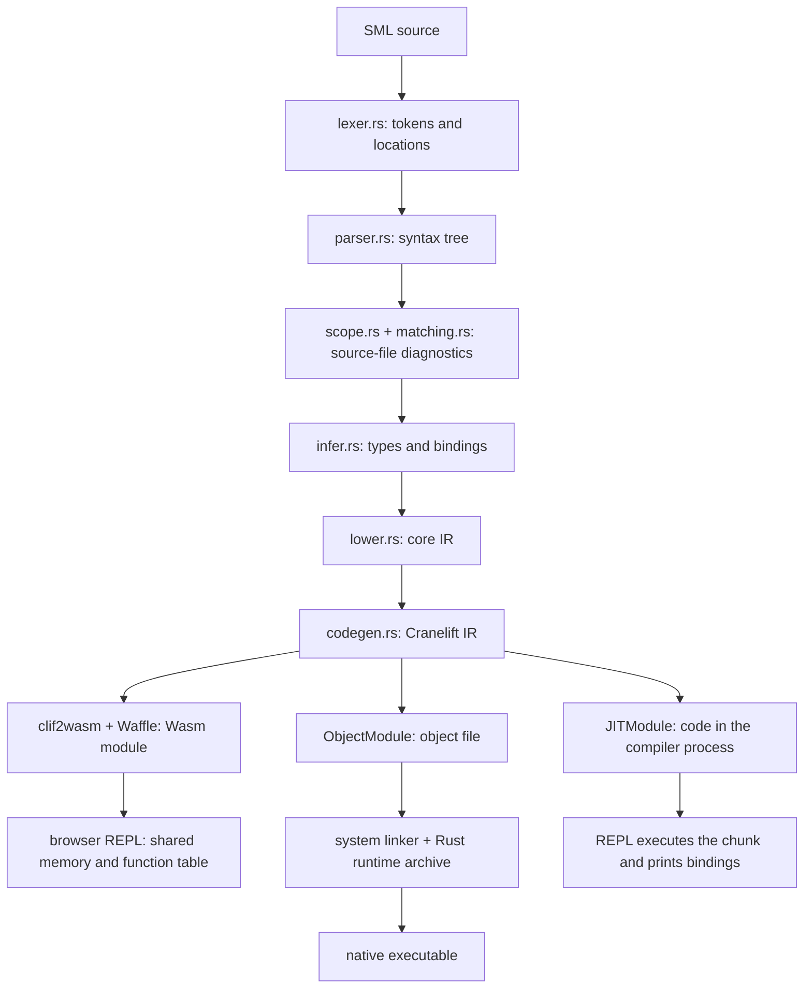

# Architecture

Nassau is a Standard ML compiler written in Rust. Cranelift emits native code
for file compilation and the native REPL. The browser REPL uses the same CLIF
emitter, then clif2wasm and Waffle translate its output to Wasm. All paths share
the type checker and lowering pass, and both REPLs share the session and value
printer.

See [grammar.md](grammar.md) for the language forms that work today.

## Pipeline

Only file compilation runs the scope and match checks. The REPL goes straight
from parsing to its persistent inference session.

[main.rs](../src/main.rs) connects the stages and implements the command-line
options. Passing a file produces an executable beside it; no file starts the
REPL. The compiler targets the host machine only.

## Front end

- [lexer.rs](../src/lexer.rs): tokens with source locations.
- [parser.rs](../src/parser.rs): the syntax tree, applying the fixities in
  scope. Nodes are wrapped in `Span<T>` ([span.rs](../src/span.rs)) so errors
  point at the offending expression or declaration.
- [scope.rs](../src/scope.rs): duplicate bindings.
- [matching.rs](../src/matching.rs): redundant and non-exhaustive matches.
  [constructors.rs](../src/constructors.rs) tracks constructor families and
  [walk.rs](../src/walk.rs) walks the tree with the right environment.
- [infer.rs](../src/infer.rs): Hindley–Milner inference, the value restriction,
  equality constraints, overloading, and flexible records. It produces top-level
  bindings and a `TypeTable` that lowering uses to pick operations and layouts.
- [infer/modules.rs](../src/infer/modules.rs): structures, signature matching,
  ascription, sharing, and functors. Each functor application gets its own
  syntax tree and types.

## Lowering

[lower.rs](../src/lower.rs) turns typed syntax into the small IR in
[core.rs](../src/core.rs): named operations grouped in blocks, each ending in a
return, jump, conditional branch, call, or exception operation.

It also captures free variables, allocates mutually recursive closures, chooses
record field positions, and records which handler covers a call.
[lower/decision.rs](../src/lower/decision.rs) compiles patterns into decision
trees with first-match semantics.

Known calls go straight to a function's worker. Calls through an unknown
function value load the code address from its closure. Structures have no
runtime object: lowering keeps their exported bindings in its environment.

## Code generation

[codegen.rs](../src/codegen.rs) translates core IR into Cranelift IR. SML
functions use Cranelift's tail calling convention and take the closure
environment first. Entry functions and calls into the support library use the
platform convention.

Tail calls use `return_call`. A call under an exception handler is an ordinary
call, because it must return to the handler.

The translator is generic over the module type:

- `ObjectModule`: object file for file compilation.
- `JITModule`: code and global cells in the compiler process, for the native
  REPL.
- `clif2wasm::WasmModule`: Wasm through Waffle, for the browser REPL.

Cargo features:

- `codegen`: the common CLIF emitter.
- `native`: adds the JIT and object backends, CLI dependencies, and the native
  runtime.
- `web`: exports the `wasm-bindgen` `BrowserRepl`.

A frontend-only library builds with `--no-default-features`. There is no core-IR
interpreter.

## Values and the runtime

Every value crossing a function boundary is one 64-bit word; the low bit tells
an immediate from a heap pointer. See
[value-representation.md](value-representation.md) for the layout.

The compiler generates helpers for string concatenation, integer formatting, and
structural equality ([codegen/helpers.rs](../src/codegen/helpers.rs)), emitting
each only when used.

[runtime/nassau_runtime.rs](../runtime/nassau_runtime.rs) is the support
library: allocation, host printing, process exit, built-in exception identities,
and the shared exception state. [build.rs](../build.rs) compiles it into
`libnassau_runtime.a`, which [src/runtime.rs](../src/runtime.rs) embeds in the
compiler. Compiling a file links the object against that archive with `cc`, or
`NASSAU_CC` if set. The JIT uses the runtime already linked into the compiler.
See [development.md](development.md) for the garbage collector.

## Exceptions

An exception value holds a constructor identity, an optional argument, and the
location of its first raise. Evaluating an `exception` declaration creates a new
identity; replication shares the existing one.

A function that raises stores the exception in a shared cell and returns `0`,
which is not a valid SML value. The caller checks for `0` and either enters its
handler or returns `0` itself. Nothing unwinds the native stack.

An exception that escapes a compiled program is reported with a failing exit
status. In the REPL it is reported and the session continues.

## Basis library

Basis modules are SML under `basis/`, embedded by
[prelude.rs](../src/prelude.rs) and checked and lowered before the user's
program in the same session. Basis code never shifts the user's line numbers.

Functions that SML can't express are primitives under reserved `Prim.` names.
The basis wraps them, as in `val toString = Prim.intToString`. A few names are
compiler-known and inline: `print`, `size`, `not`, `~`, `^`, `ref`, `!`, `:=`,
and equality. Everything else, such as `map` and `length`, is SML in `basis/`.

`--dump-expr-types` lists only the user's nodes. `--dump-core` skips the basis,
so it can't dump a program that uses a basis structure.

## REPL

[session.rs](../src/session.rs) owns the persistent inference and lowering
environments. [repl.rs](../src/repl.rs) is the native JIT backend and terminal
input; [web.rs](../src/web.rs) is the browser Wasm backend. Both use
[printing.rs](../src/printing.rs) to print values.

- The basis runs as a hidden first chunk, and again after `reset;;`.
- Top-level semicolons split input into phrases. A failed phrase keeps the
  bindings from earlier ones, including on the same line.
- A chunk is checked against copies of the environments, which become current
  only if compilation succeeds.
- If execution raises an uncaught exception, the REPL restores the earlier type
  environment. Effects on existing references and printed output are not rolled
  back.
- Values print by decoding them with their resolved types. JIT exception
  identities carry a type descriptor so exceptions print outside their declaring
  scope.
- Printing is bounded so cyclic references and long lists terminate.

### Browser

[www](../www/README.md) packages the compiler for `wasm32-unknown-unknown`, with
a worker that owns the session. Each submission becomes a Wasm module that
imports the session's memory, function table, and stack pointer. Earlier
function exports and stable global addresses keep saved closures working after a
binding is shadowed.

The JavaScript runtime provides allocation, mark-and-sweep collection, output,
and exception state. Stop and reset replace the worker, releasing its heap.

## Debugging the pipeline

| Option                         | Shows                                         |
| ------------------------------ | --------------------------------------------- |
| `--dump-tokens`                | Tokens and locations                          |
| `--dump-ast`                   | Syntax, nesting, and operator grouping        |
| `--dump-types`                 | Inferred top-level bindings                   |
| `--dump-expr-types`            | Types of every expression and pattern         |
| `--dump-core`                  | Lowering, closures, decision trees, and calls |
| `--dump-ir`                    | Cranelift IR before optimization              |
| `--dump-optimized-ir --verify` | Optimized IR, verified                        |
| `--asm`                        | Cranelift's target instruction listing        |
| `--objdump`                    | Disassembly of the emitted object             |

`--timings` and `--stats` report backend timing and code size. An "unsupported
construct" error usually comes from lowering: the front end accepted something
the backend can't yet run.

## Tests

Tests are SML fixtures, not unit tests.
[tests/fixtures.rs](../tests/fixtures.rs) picks the compiler mode for each
fixture, and [tests/repl.rs](../tests/repl.rs) runs REPL transcripts. Expected
output sits beside the input as FileCheck directives, and Poly/ML is the oracle
for program output. See [development.md](development.md) for running and
regenerating them.
